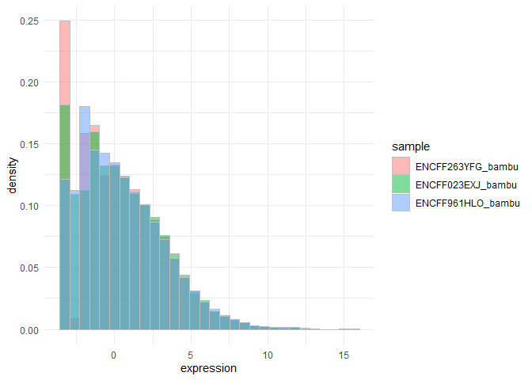
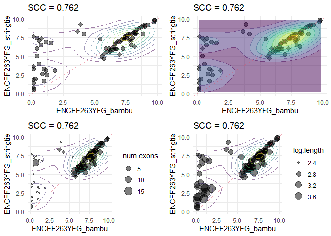
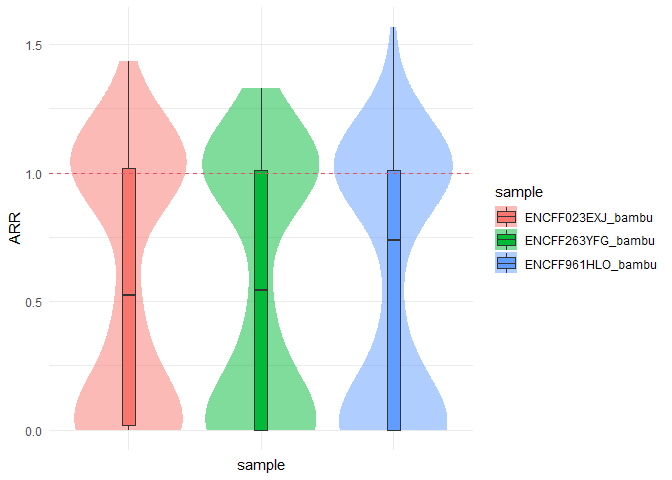
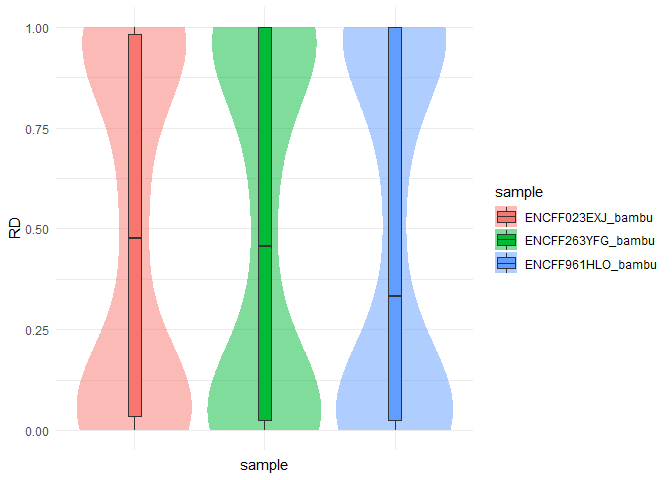
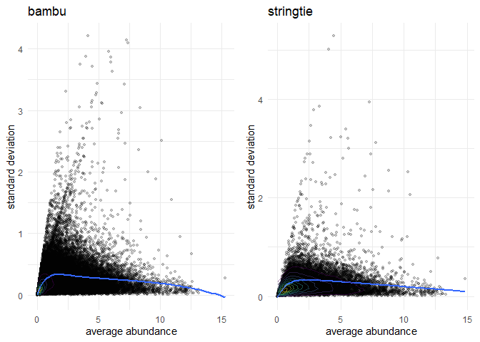
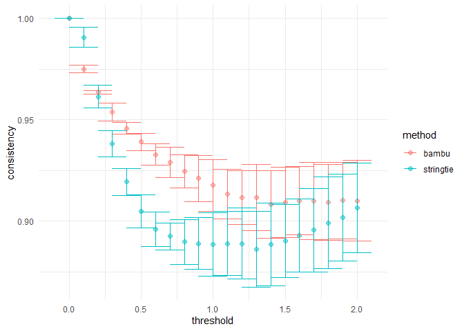
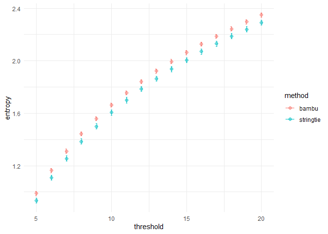

<!-- README.md is generated from README.Rmd. Please edit that file -->

# qeval

## Installation

``` r
install.packages("devtools")
devtools::install_github("jleechung/qeval")
```

## Usage

``` r
library(qeval)

library(SummarizedExperiment)
library(ggplot2)
library(gridExtra)
```

Inputs path to files and their corresponding methods:

``` r
gtf <- list.files(system.file('extdata', package = 'qeval'), full.names = TRUE, pattern = 'rds')
path <- list.files(system.file('extdata', package = 'qeval'), full.names = TRUE, pattern = 'test_data')
list.files(path)
#> [1] "WTC11_cDNA_ONT_bambu.tsv"      "WTC11_cDNA_ONT_nanocount.tsv" 
#> [3] "WTC11_cDNA_ONT_salmon.tsv"     "WTC11_cDNA_ONT_stringtie2.tsv"
methods <- c('bambu', 'nanocount', 'salmon', 'stringtie')
se <- constructSE(path, methods)
#> Reading 4 files
#> Found duplicate rows in file C:/Users/josep/OneDrive/Documents/R/win-library/4.0/qeval/extdata/test_data/WTC11_cDNA_ONT_stringtie2.tsv
#> Duplicated IDs: ENST00000431116.2, ENST00000432924.2, ENST00000435269.1
#> Taking mean of duplicated entries
#> Merge assays
#> Constructing summarized experiment
```

Annotate the summarized experiment:

``` r
gtf <- readRDS(gtf)
se <- annotateSE(se, gtf)
se
#> class: SummarizedExperiment 
#> dim: 239225 12 
#> metadata(0):
#> assays(1): values
#> rownames(239225): DQ459412 DQ459413 ... tx.998 tx.999
#> rowData names(3): tx.id num.exons length
#> colnames(12): ENCFF263YFG_bambu ENCFF023EXJ_bambu ...
#>   ENCFF023EXJ_stringtie ENCFF961HLO_stringtie
#> colData names(6): ID method ... nonzero files
```

For convenience:

``` r
cdata <- colData(se)
sample_bambu <- cdata$ID[cdata$method == 'bambu']
sample_nanocount <- cdata$ID[cdata$method == 'nanocount']
sample_salmon <- cdata$ID[cdata$method == 'salmon']
sample_stringtie <- cdata$ID[cdata$method == 'stringtie']
```

## Visualisation

``` r
plotHistogram(se, sample_bambu) 
#> Warning in `[.data.table`(values, , ..samples): Both 'samples' and '..samples'
#> exist in calling scope. Please remove the '..samples' variable in calling scope
#> for clarity.
#> `stat_bin()` using `bins = 30`. Pick better value with `binwidth`.
```



We subset to spike-in data:

``` r
features <- rownames(se)[!grepl('^ENST', rownames(se))] ## Spike-ins
```

Draw scatter plots with Spearman correlation between bambu and
stringtie:

``` r
rowData(se)$log.length <- log10(rowData(se)$length + 1) ## Add log-length to row data
p1 <- plotScatter(se, sample_bambu[1], sample_stringtie[1], features = features)
p2 <- plotScatter(se, sample_bambu[1], sample_stringtie[1], density = T, features = features)
p3 <- plotScatter(se, sample_bambu[1], sample_stringtie[1], density = F, features = features, annotate = 'num.exons')
p4 <- plotScatter(se, sample_bambu[1], sample_stringtie[1], density = F, features = features, annotate = 'log.length')
grid.arrange(p1, p2, p3, p4, nrow = 2, ncol = 2)
```



## Accuracy metrics

``` r
features <- rownames(se)[!grepl('^ENST', rownames(se))] ## Spike-ins
samples <- colnames(se)
sample <- sample_bambu ## bambu 
reference <- sample_stringtie ## use stringtie as a baseline for comparison
```

Abundance recovery rate:

``` r
ARR <- computeRecovery(se, sample, reference, features = features)
ARR$metrics
#> ENCFF263YFG_bambu ENCFF023EXJ_bambu ENCFF961HLO_bambu 
#>         0.5446095         0.5233675         0.7388389
ARR$plot + geom_hline(yintercept = 1, linetype = 'dashed', color = 2)
```



Relative difference:

``` r
RD <- computeDifference(se, sample, reference, features = features)
RD$metrics
#> ENCFF263YFG_bambu ENCFF023EXJ_bambu ENCFF961HLO_bambu 
#>         0.4553905         0.4766325         0.3329107
RD$plot
```



Normalized root mean squared error:

``` r
computeNRMSE(se, sample, reference, features = features)
#> ENCFF263YFG_bambu ENCFF023EXJ_bambu ENCFF961HLO_bambu 
#>         0.7812280         0.8013901         0.7932782
```

## Reproducibility and consistency metrics

Reproducibility:

``` r
rep1 <- computeReproducibility(se, sample_bambu, pt.alpha = 0.2)
#> Warning in `[.data.table`(values, , ..samples): Both 'samples' and '..samples'
#> exist in calling scope. Please remove the '..samples' variable in calling scope
#> for clarity.
rep1$metric
#> [1] 0.3247098
r1 <- rep1$plot + labs(title = 'bambu')

rep2 <- computeReproducibility(se, sample_stringtie, pt.alpha = 0.2)
#> Warning in `[.data.table`(values, , ..samples): Both 'samples' and '..samples'
#> exist in calling scope. Please remove the '..samples' variable in calling scope
#> for clarity.
rep2$metric
#> [1] 0.3790168
r2 <- rep2$plot + labs(title = 'stringtie')

grid.arrange(r1, r2, ncol = 2)
```



Consistency:

``` r
samples <- c(sample_bambu, sample_stringtie)
computeConsistency(se, samples)
#> Warning in `[.data.table`(values, , ..samples): Both 'samples' and '..samples'
#> exist in calling scope. Please remove the '..samples' variable in calling scope
#> for clarity.
#> Warning in `[.data.table`(values, , ..keep): Both 'keep' and '..keep' exist in
#> calling scope. Please remove the '..keep' variable in calling scope for clarity.

#> Warning in `[.data.table`(values, , ..keep): Both 'keep' and '..keep' exist in
#> calling scope. Please remove the '..keep' variable in calling scope for clarity.
#> $plot
```



    #> 
    #> $metric
    #> $metric$bambu
    #>   threshold=0 threshold=0.1 threshold=0.2 threshold=0.3 threshold=0.4 
    #>     1.0000000     0.9744643     0.9640179     0.9515179     0.9450000 
    #> threshold=0.5 threshold=0.6 threshold=0.7 threshold=0.8 threshold=0.9 
    #>     0.9384821     0.9317857     0.9266964     0.9216964     0.9162500 
    #>   threshold=1 threshold=1.1 threshold=1.2 threshold=1.3 threshold=1.4 
    #>     0.9111607     0.9082143     0.9076786     0.9072321     0.9012500 
    #> threshold=1.5 threshold=1.6 threshold=1.7 threshold=1.8 threshold=1.9 
    #>     0.8997321     0.9016071     0.9008036     0.9008929     0.8995536 
    #>   threshold=2 
    #>     0.8991071 
    #> 
    #> $metric$stringtie
    #>   threshold=0 threshold=0.1 threshold=0.2 threshold=0.3 threshold=0.4 
    #>     1.0000000     0.9880357     0.9591964     0.9349107     0.9156250 
    #> threshold=0.5 threshold=0.6 threshold=0.7 threshold=0.8 threshold=0.9 
    #>     0.9027679     0.8931250     0.8908929     0.8886607     0.8871429 
    #>   threshold=1 threshold=1.1 threshold=1.2 threshold=1.3 threshold=1.4 
    #>     0.8832143     0.8841964     0.8844643     0.8819643     0.8840179 
    #> threshold=1.5 threshold=1.6 threshold=1.7 threshold=1.8 threshold=1.9 
    #>     0.8850893     0.8878571     0.8884821     0.8895536     0.8940179 
    #>   threshold=2 
    #>     0.8967857

Resolution entropy:

``` r
samples <- c(sample_bambu, sample_stringtie)
computeResEntropy(se, samples)
#> Warning in `[.data.table`(values, , ..samples): Both 'samples' and '..samples'
#> exist in calling scope. Please remove the '..samples' variable in calling scope
#> for clarity.
#> Warning in `[.data.table`(values, , ..keep): Both 'keep' and '..keep' exist in
#> calling scope. Please remove the '..keep' variable in calling scope for clarity.

#> Warning in `[.data.table`(values, , ..keep): Both 'keep' and '..keep' exist in
#> calling scope. Please remove the '..keep' variable in calling scope for clarity.
#> $plot
```



    #> 
    #> $metric
    #> $metric$bambu
    #>    nbin=5    nbin=6    nbin=7    nbin=8    nbin=9   nbin=10   nbin=11   nbin=12 
    #> 0.9803292 1.1556703 1.3035150 1.4341568 1.5511848 1.6538753 1.7484518 1.8326309 
    #>   nbin=13   nbin=14   nbin=15   nbin=16   nbin=17   nbin=18   nbin=19   nbin=20 
    #> 1.9128475 1.9860879 2.0538298 2.1181634 2.1782012 2.2363300 2.2892213 2.3399609 
    #> 
    #> $metric$stringtie
    #>    nbin=5    nbin=6    nbin=7    nbin=8    nbin=9   nbin=10   nbin=11   nbin=12 
    #> 0.9300518 1.1019286 1.2505439 1.3796928 1.4946449 1.5993542 1.6930902 1.7808875 
    #>   nbin=13   nbin=14   nbin=15   nbin=16   nbin=17   nbin=18   nbin=19   nbin=20 
    #> 1.8588336 1.9299735 1.9991827 2.0640776 2.1233931 2.1813173 2.2347597 2.2847165

## Session Info

``` r
sessionInfo()
#> R version 4.0.3 (2020-10-10)
#> Platform: x86_64-w64-mingw32/x64 (64-bit)
#> Running under: Windows 10 x64 (build 19043)
#> 
#> Matrix products: default
#> 
#> locale:
#> [1] LC_COLLATE=English_Singapore.1252  LC_CTYPE=English_Singapore.1252   
#> [3] LC_MONETARY=English_Singapore.1252 LC_NUMERIC=C                      
#> [5] LC_TIME=English_Singapore.1252    
#> 
#> attached base packages:
#> [1] parallel  stats4    stats     graphics  grDevices utils     datasets 
#> [8] methods   base     
#> 
#> other attached packages:
#>  [1] gridExtra_2.3               ggplot2_3.3.5              
#>  [3] SummarizedExperiment_1.20.0 Biobase_2.50.0             
#>  [5] GenomicRanges_1.42.0        GenomeInfoDb_1.26.7        
#>  [7] IRanges_2.24.1              S4Vectors_0.28.1           
#>  [9] BiocGenerics_0.36.1         MatrixGenerics_1.2.1       
#> [11] matrixStats_0.60.0          qeval_0.0.0.9000           
#> 
#> loaded via a namespace (and not attached):
#>  [1] tidyselect_1.1.1       xfun_0.25              purrr_0.3.4           
#>  [4] splines_4.0.3          lattice_0.20-41        colorspace_2.0-2      
#>  [7] vctrs_0.3.8            generics_0.1.0         viridisLite_0.4.0     
#> [10] htmltools_0.5.2        mgcv_1.8-33            yaml_2.2.1            
#> [13] utf8_1.2.2             rlang_0.4.11           isoband_0.2.5         
#> [16] pillar_1.6.3           glue_1.4.2             withr_2.4.2           
#> [19] DBI_1.1.1              GenomeInfoDbData_1.2.4 lifecycle_1.0.1       
#> [22] stringr_1.4.0          zlibbioc_1.36.0        munsell_0.5.0         
#> [25] gtable_0.3.0           evaluate_0.14          labeling_0.4.2        
#> [28] knitr_1.36             fastmap_1.1.0          fansi_0.5.0           
#> [31] highr_0.9              scales_1.1.1           DelayedArray_0.16.3   
#> [34] XVector_0.30.0         farver_2.1.0           digest_0.6.28         
#> [37] stringi_1.7.3          dplyr_1.0.7            grid_4.0.3            
#> [40] tools_4.0.3            bitops_1.0-7           magrittr_2.0.1        
#> [43] RCurl_1.98-1.3         tibble_3.1.3           crayon_1.4.1          
#> [46] pkgconfig_2.0.3        MASS_7.3-53            ellipsis_0.3.2        
#> [49] Matrix_1.3-4           data.table_1.14.0      assertthat_0.2.1      
#> [52] rmarkdown_2.11         R6_2.5.1               nlme_3.1-149          
#> [55] compiler_4.0.3
```
